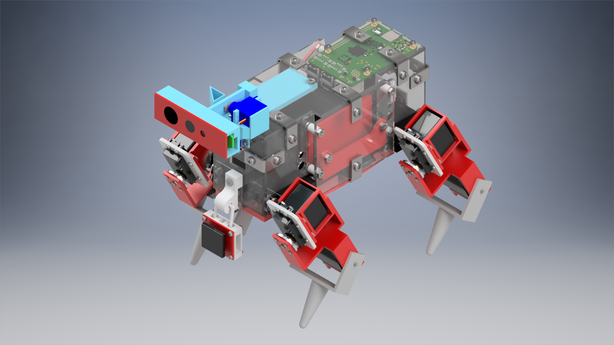
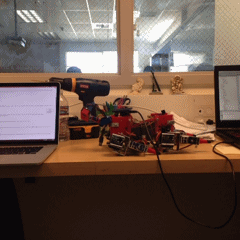

# Red Eclipse Framework

This repository contains all code used by Eclipse Technologies in the 2016 CARPA Initiative Challenge - The Lycanthrope Project. Failure in any aspect of the project is not in any way related to deficiencies in the code of this framework.

### The Mission

One transforming walker with two quadruped robots that can autonomously seek out and capture a randomly moving prey on the field using RFID. Sounds hard? It was. Find out more information about the mission in the `docs/mission` folder. 

### The Robot

Although the final iteration of CAD files for the robot was lost, I managed to reconstruct and redesign the robot with more reasonable alignment and features. The CAD is very similar to the robot used on mission day, but is not identical. Materials are correctly defined but I probably made some parts too glossy. Various attachments and wires are not shown. The image is the result of 2,000 rendering iterations.

The final product featured:
- Fully wireless communication
- 50 minute continuous run time
- Crawl and trot gaits
- A top speed of 10 cm/s
- Forward, backward, and rotational (turning) motions
- Video stream
- Object tracking and motion detection
- Object learning and recognition
- Single camera SLAM (external processing)
- Audio feed and pitch recognition
- Voice control
- Fully rotatable head
- RFID scanning
- Fine leg motion (pushing buttons)
- Basic "follow" capacity (not well-tested)
- A price tag under $500

Most detailed information about the robot and its design can be found in the `docs/cdr` folder. Errors in these documents are corrected in `docs/src/tutorial.html`.

### The Code

Lots of tears with lots code. I did not manage to get autonomous mode fully functional. However, I did make a cool command interface. For all programming related documentation, look no further than `docs/src`. How good is the code? The GIF below tells you all.

### The Result

The mission was a success, although some requirements were dropped last minute. The condensed version of the final mission can be seen on YouTube.

[https://www.youtube.com/watch?v=wLcxDFeVisM](https://www.youtube.com/watch?v=wLcxDFeVisM)

We also made a team documentary. It is also on YouTube.

[https://www.youtube.com/watch?v=LzQ_4Fg-2XM](https://www.youtube.com/watch?v=LzQ_4Fg-2XM)
